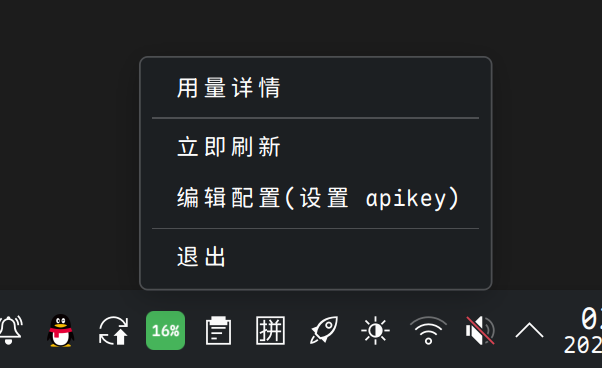

# glm-quota

在 Linux 桌面（KDE Plasma / 任意支持系统托盘的环境）**常驻显示智谱 GLM Coding Plan 用量**的小工具。任务栏托盘图标直接显示当前 5 小时窗口的已用百分比，颜色随用量变化，点开看套餐等级与重置时间。



## 功能

- 🔔 **托盘常驻**：图标直接显示百分比（如 `16%`），颜色随用量变化（绿 < 60% / 橙 60-85% / 红 > 85% / key 失效标 `ERR`）
- 🖱️ **左键刷新**，右键菜单：用量详情 / 立即刷新 / 编辑配置 / 退出
- ⏱️ **自动刷新**：默认每 5 分钟（与 cc-switch 对齐，可配置）
- 🚨 **超量通知**：用量超过阈值时弹桌面通知（默认 85%，可关闭）
- 📊 **命令行版**：`glm-quota` 终端敲一下就看，支持 `--watch` / `--json`
- 🛡️ **容错**：网络失败保留上次成功值；后台线程查询不卡 UI
- 🔒 **安全**：api_key 只存本地配置文件（权限 600），不进代码、不落日志

## 查询原理

查询逻辑复刻自 [cc-switch](https://github.com/farion1231/cc-switch)（`src-tauri/src/services/coding_plan.rs::query_zhipu`），并用其仓库内的单元测试用例验证过解析逻辑：

- `GET {base_url}/api/monitor/usage/quota/limit`，`Authorization` 头直接放 api_key（**不加** `Bearer` 前缀）
- `base_url` 含 `bigmodel.cn` → 中国站 `open.bigmodel.cn`；否则 → 国际站 `api.z.ai`
- 从 `data.limits[]` 中取 `type == "TOKENS_LIMIT"` 的条目，按 `unit` 字段分类窗口（`unit:3` → 5 小时窗口，`unit:6` → 每周窗口）
- `data.level` 作为套餐等级

## 依赖

- Python 3.8+
- **PyQt6**（托盘版需要）：`pip install --user PyQt6`
- 命令行版与核心模块**零额外依赖**（仅 Python 标准库）

## 安装

```bash
git clone https://github.com/by-yitong/glm-quota.git
cd glm-quota
pip install --user PyQt6     # 托盘版需要
./install.sh                 # 部署到 ~/.local/bin 等，配置开机自启
```

`install.sh` 会把脚本装到 `~/.local/bin`、核心模块到 `~/.local/share/glm-quota`、开机自启到 `~/.config/autostart`，并创建配置模板 `~/.config/glm-quota/config.json`。

## 配置

编辑 `~/.config/glm-quota/config.json`（或运行 `glm-quota set-key` 交互式填入）：

```json
{
  "api_key": "你的智谱 api_key",
  "base_url": "https://open.bigmodel.cn",
  "refresh_minutes": 5,
  "notify_threshold": 85
}
```

| 字段 | 说明 |
|---|---|
| `api_key` | 智谱开放平台 / Z.ai 控制台获取。国内站(bigmodel.cn)与国际站(z.ai)的 key 不通用 |
| `base_url` | 含 `bigmodel.cn` 走中国站，否则走国际站 `api.z.ai` |
| `refresh_minutes` | 托盘自动刷新间隔（分钟），`0` = 关闭自动刷新 |
| `notify_threshold` | 超过该百分比弹通知，`0` = 关闭通知 |

## 使用

```bash
# 命令行查用量
glm-quota

# watch 模式，每 60 秒刷新
glm-quota --watch

# 输出 JSON（便于脚本处理）
glm-quota --json

# 交互式设置 api_key
glm-quota set-key

# 启动托盘常驻
glm-quota-tray &
```

输出示例：

```
✅ 智谱 GLM Coding Plan 用量
套餐等级: max
----------------------------------------
5小时窗口    ███░░░░░░░░░░░░░░░░░  16.0%
         重置时间: 2026-06-25 04:03 (CST)
----------------------------------------
查询时间: 2026-06-25 02:48:23
```

## 文件说明

| 文件 | 作用 |
|---|---|
| `glm_quota_core.py` | 核心查询/解析模块（urllib，零依赖） |
| `glm-quota` | 命令行版 |
| `glm-quota-tray` | PyQt6 系统托盘常驻版 |
| `glm-quota-tray.desktop` | 开机自启入口 |
| `config.example.json` | 配置模板 |

## 致谢

查询逻辑参考了 [cc-switch](https://github.com/farion1231/cc-switch) 项目（MIT License）。

## License

MIT
